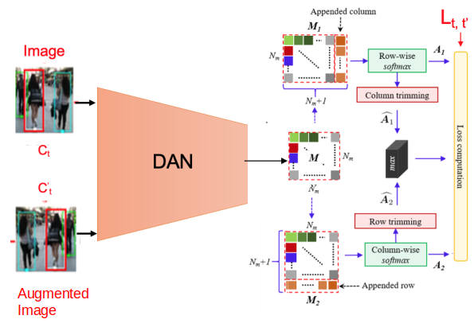

# Self-Supervised-Affinity-MOT
Self supervised deep affinity network for multi object tracking in EO.



### Installation
> Create a new environment named **SS_DAN** as follows:
>
> ```shell
> conda env create -f ss_dan.yml
> source activate SS_DAN
> ```

## Train & Test On MOT17
### Download dataset

1. Download the [mot 17 dataset 5.5 GB](https://motchallenge.net/data/MOT17.zip) and [development kit 0.5 MB](https://motchallenge.net/data/devkit.zip).

2. Unzip the dataset. Here is my file structure.

   ```shell
   MOT17
   ├── test
   └── train
   ```
   
### Reproduce the results

1. Download the weigths from [*OneDrive*](https://knightsucfedu39751-my.sharepoint.com/:f:/g/personal/sirnam_swetha_knights_ucf_edu/EiYfQ5jDmiFGo404iwBMS7EBBQb0rffLLsuwDHDWGFopDQ?e=YaSAuf) to the **weights** folder

2. Modify **config/config.py** as follows:

   ```python
   # You need to modify line 8.
   8	current_select_configure = 'init_test_mot17' # need use 'init_test_mot17'
   ```

3. run *test_mot17.py*

   ```shell
   # To test the model for SDP detections
   python test_mot17.py --log_folder 'path_to_save_predictions' --resume 'weights/sdp_ss_weights.pth' --save_base_path ' ' --mot_root 'path to mot dataset root'
   ```

### Train

1. Modify **config/config.py** as follows:

   ```python
   # you need to modify line 8, 89 and 100.
   8	current_select_configure = 'init_train_mot17' # need use 'init_train_mot17'
   ...	...
   85	def init_train_mot17():
   89		config['mot_root'] = 'replace by your mot17 dataset folder'
   100		config['detector'] = 'SDP' # choose SDP/FRCNN/DPM detector
   ```

3. Run *train_ss_mot17.py*

   ```shell
   python train_ss_mot17.py --save_base_path 'path to save model and output'
   ```

## Acknowledgement

This code is based on [**SST**](https://github.com/shijieS/SST).

## Citation
> Sun. S., Akhtar, N., Song, H.,  Mian A., & Shah M. (2018). Deep Affinity Network for Multiple Object Tracking, Retrieved from [https://arxiv.org/abs/1810.11780](https://arxiv.org/abs/1810.11780)

